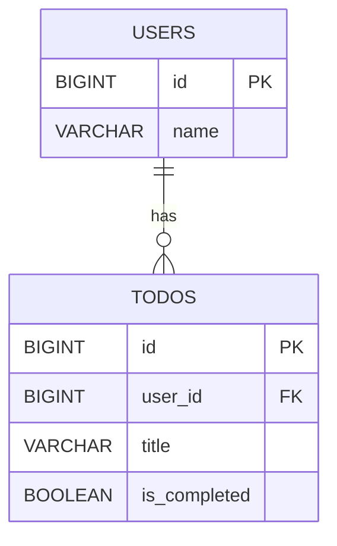

# GraphQL 学習用リポジトリ

Spring for GraphQL を使って GraphQL の学習をするためのリポジトリ。

## アプリ概要

シンプルな Todo アプリケーション。

### ER図



### API

これらに対する操作を REST API と GraphQL の両方で提供する。
実装は [src/main/kotlin/com/example/learn/graphql/controller](src/main/kotlin/com/example/learn/graphql/controller)
ディレクトリ。

### 使用ライブラリ

- Spring Boot
- Spring for GraphQL
- Spring Data JPA
- H2 Database

## 起動方法

```bash
./gradlew bootRun
```

起動後に http://localhost:8080/ から Swagger UI と GraphiQL へ遷移できます。