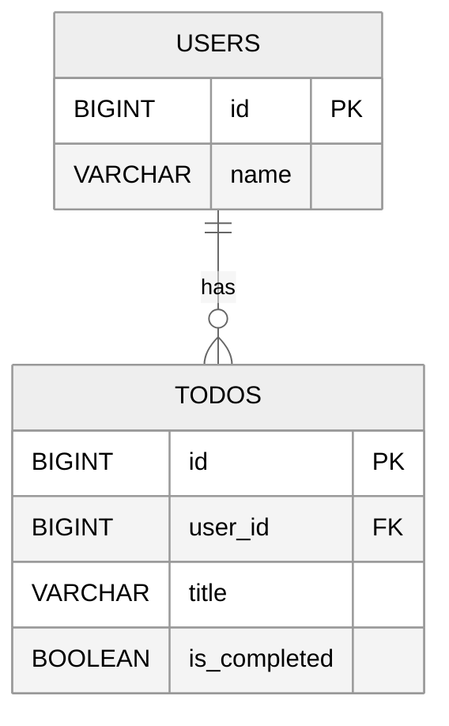

# GraphQL 学習用リポジトリ

Spring for GraphQL + React, Relay を使って GraphQL の学習をするためのリポジトリ。

## アプリ概要

シンプルな Todo アプリケーション。

### ER図



### API

これらに対する操作を REST API と GraphQL の両方で提供する。
実装は [server/src/main/kotlin/com/example/learn/graphql/controller](server/src/main/kotlin/com/example/learn/graphql/controller)
ディレクトリ。

## 起動方法

GraphQL サーバーを起動する。

```bash
cd server
./gradlew bootRun
```

React アプリケーションを起動する。

```bash
cd server
npm run dev
```

起動後に http://localhost:5173/ でアプリケーションにアクセスできる。
http://localhost:8080/ から Swagger UI と GraphiQL へのリンクもあります。
